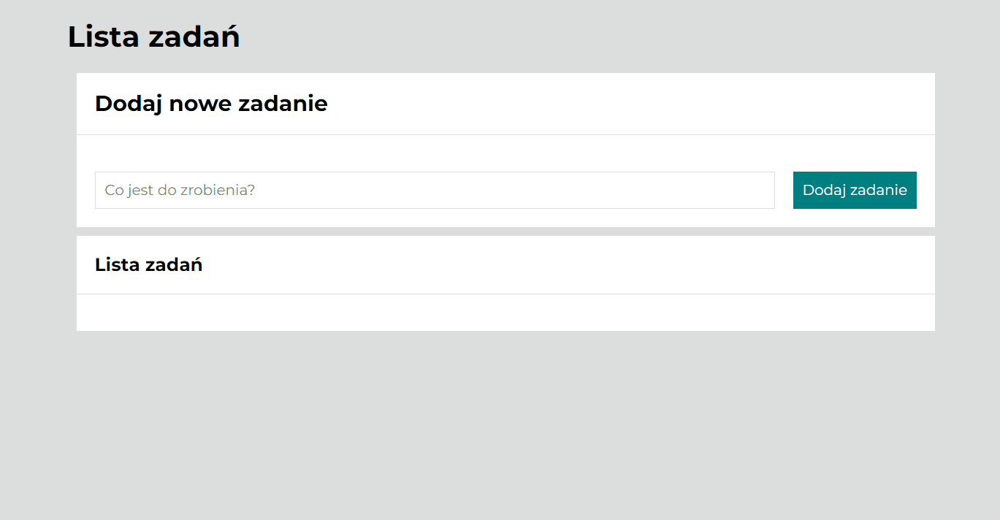

# To do List
Hello, it is my third website. 
My "to do list" is simple application for scheduling tasks. 
I am learning programming with a YouCode programming course.
I hope that you can see my progress because it is difficult.

## Interface view

# Demo
https://maram-9.github.io/toDoList/

## Languages and conventions used in the project:
- HTML
- JS
- CSS
- BEM
- ES6+ features
- Grid layout
- @media queries